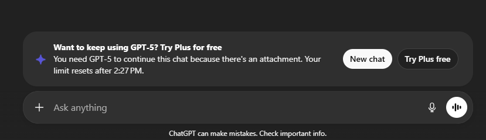

# Enable Chat Submit Button — Tampermonkey Script



A simple Tampermonkey userscript to enable the **Chat Submit** button on GPT-powered pages.

## 🚀 What This Is

This repository contains a userscript that:

- Restores or enables the submit button on GPT interfaces
- Runs custom JavaScript to tweak page behavior
- Improves UI experience for GPT chat pages

## 📌 What is GPT?

GPT (Generative Pre-trained Transformer) is an AI language model by OpenAI used for:

- Chatting
- Code generation
- Writing assistance
- Summarization
- Instruction following

This script enhances the **UI experience** when using GPT pages where the submit button may be disabled.

## 🔗 Required Add-ons

### Tampermonkey

Install Tampermonkey for your browser:  
[Chrome Web Store — Tampermonkey](https://chromewebstore.google.com/detail/tampermonkey/dhdgffkkebhmkfjojejmpbldmpobfkfo)

---

## 📄 Script: `Enable Chat Submit Button‑2026‑01‑03.user.js`

```javascript
// ==UserScript==
// @name         Bypass GPT
// @namespace    http://tampermonkey.net/
// @version      2026-01-03
// @description  Automatically enable the ChatGPT submit button
// @author       Acyber Team Security @github->mrmtwoj
// @match        https://chatgpt.com/c/*
// @icon         https://www.google.com/s2/favicons?sz=64&domain=chatgpt.com
// @grant        none
// @run-at       document-idle
// ==/UserScript==

(function() {
    'use strict';

    function enableSubmitButton() {
        const button = document.getElementById('composer-submit-button')
                    || document.querySelector('button[type="submit"]');
        if (button) {
            button.removeAttribute('disabled');
            console.log("Submit button enabled!");
        }
    }

    window.addEventListener('load', function() {
        setInterval(enableSubmitButton, 3000);
    });

})();

